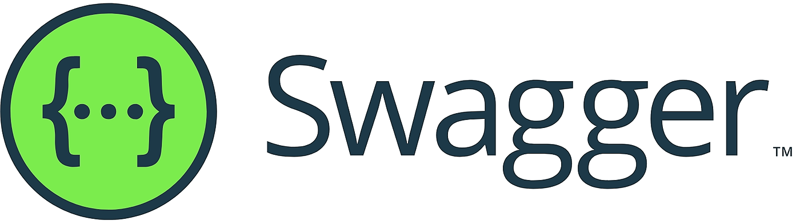
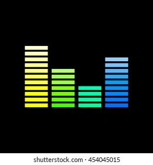
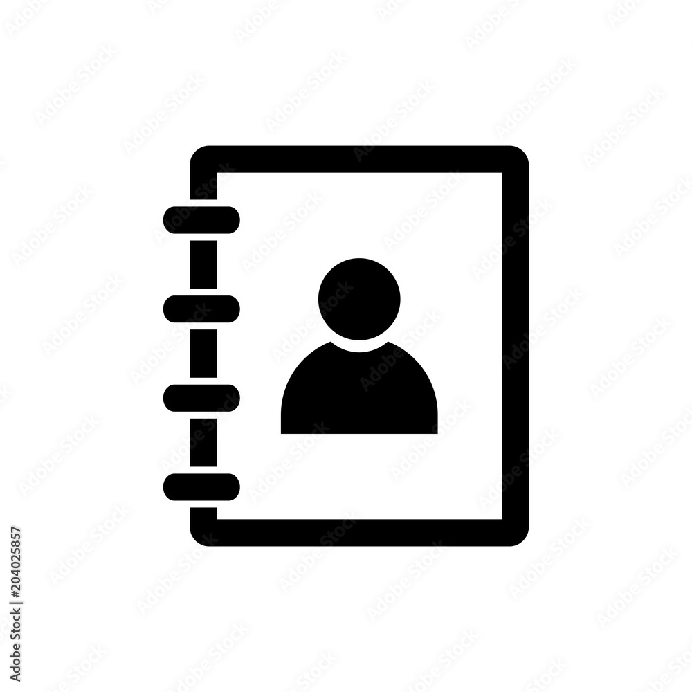

## Hi there 👋, my name is Sviataslau Bely

## 🙋‍♂️ About me

Hi! I’m a Poland-based developer 🇵🇱 who enjoys crafting reliable, testable software ✅. On the frontend, I work with
React ⚛️, TypeScript 🟦, and Vue 🟢; on the backend I’m comfortable with Java ☕ and Spring 🌱. I value clear APIs 🔗,
maintainable code 🧼, and good observability 🔭. When I’m not shipping features, you’ll find me snowboarding 🏂, cycling
🚴‍♂️, sketching 🎨, or lifting 🏋️.

## 🚀 Projects

<table>
  <tr>
    <td></td>
    <td><a href="https://github.com/svyataslau/monster-product-site"><b>Dimension. Three.js</b></a></td>
    <td>3D web project with interactive graphics</td>
    <td><a href="https://cola-advertisement.vercel.app/">DEPLOYED</a></td>
  </tr>

  <tr>
    <td></td>
    <td><b>Authentication Service [Private repo]</b></td>
    <td></td>
    <td>MIGHT BE DEPLOYED ON AWS (ask me)</td>
  </tr>

  <tr>
    <td></td>
    <td><b>Authentication Service Swagger [Private repo]</b></td>
    <td>API documentation</td>
    <td>MIGHT BE DEPLOYED ON AWS (ask me)</td>
  </tr>

  <tr>
    <td></td>
    <td><a href="https://github.com/svyataslau/atm-console"><b>ATM Console</b></a></td>
    <td>console-based ATM application</td>
    <td><a href="https://github.com/svyataslau/atm-console">REPO</a></td>
  </tr>

  <tr>
    <td></td>
    <td><a href="https://github.com/svyataslau/Analyser"><b>CYBER PARTY</b></a></td>
    <td></td>
    <td><a href="https://analyser-seven.vercel.app/">DEPLOYED</a></td>
  </tr>

  <tr>
    <td></td>
    <td><a href="https://blagodatskih.com/"><b>Translation Agency</b></a></td>
    <td></td>
    <td><a href="https://blagodatskih.com/">DEPLOYED</a></td>
  </tr>

<tr>
    <td></td>
    <td><a href="https://github.com/svyataslau/clear-ui-lib"><b>Clear UI Storybook</b></a></td>
    <td>Storybook project</td>
    <td><a href="https://clear-ui-lib-theta.vercel.app/">DEPLOYED</a></td>
  </tr>

<tr>
    <td></td>
    <td><a href="https://github.com/svyataslau/clear-frontend-app"><b>Clear (Social media app)</b></a></td>
    <td>Storybook components consumer app</td>
    <td><a href="https://clear-frontend-app.vercel.app/">DEPLOYED</a></td>
  </tr>

<tr>
    <td></td>
    <td><a href="https://github.com/svyataslau/vs_front"><b>vs_front</b></a></td>
    <td></td>
    <td><a href="https://thechallenge.vercel.app">CODE REQUIRE UPDATE</a></td>
  </tr>

<tr>
    <td></td>
    <td><a href="https://github.com/svyataslau/vs_server"><b>vs_server</b></a></td>
    <td></td>
    <td><a href="">CODE SUPER OUTDATED</a></td>
  </tr>

<tr>
    <td></td>
    <td><a href="https://github.com/svyataslau/contact-book"><b>Contact book</b></a></td>
    <td></td>
    <td><a href="https://contact-book-test2.vercel.app/">CODE SUPER OUTDATED</a></td>
  </tr>
</table>
